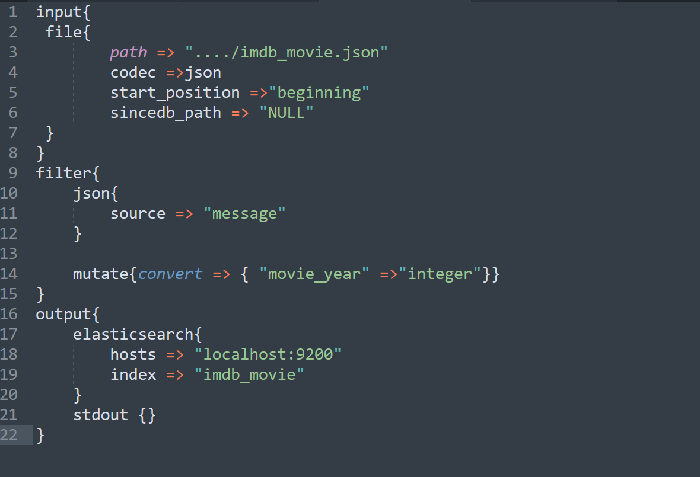
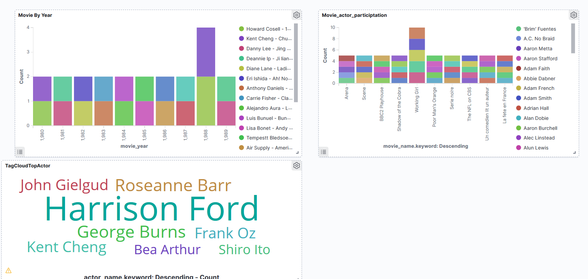
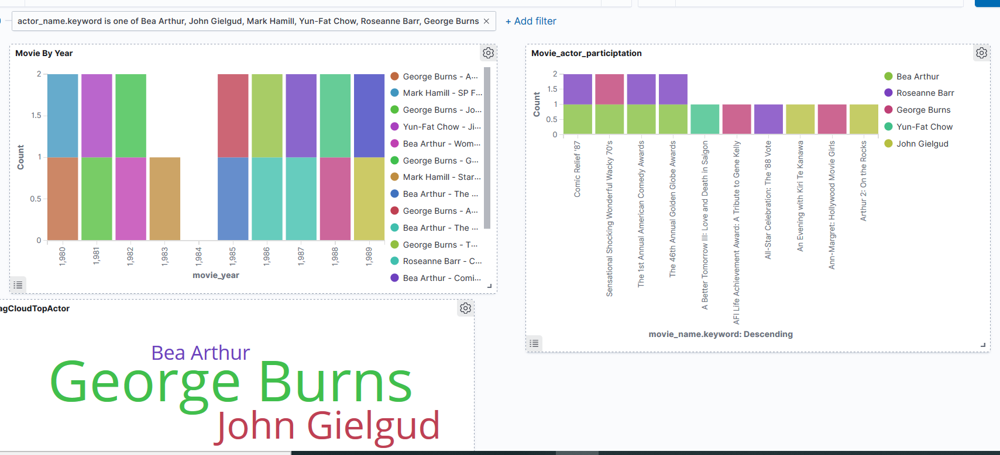
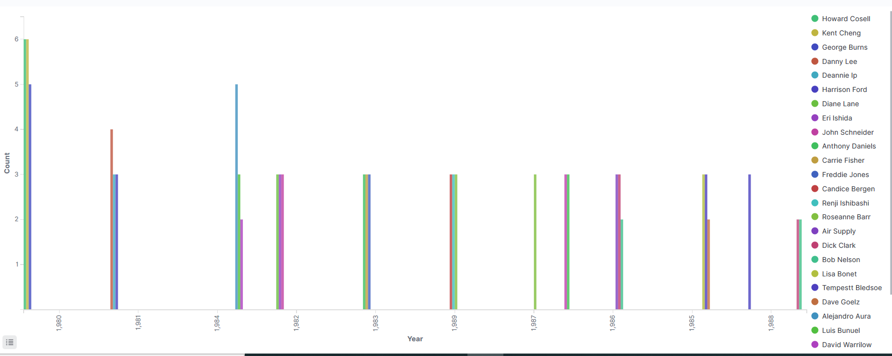

# Cloud Computing Lab 7

## Task 7.3: Study the obtained data using the Elastic Stack

Basically, for this section we use local instalation of Elastic Stack due to the cloud version was not configured properly.

After we scraped the data we analyze it using the **elastic stack software** which is a collection of three major components  which are **Elasticsearch, Logstash, and Kibana** 
1. **Logstash**-  tool for managing events and logs
2. **Elasticsearch**-a document-oriented NoSQL database designed to store, retrieve and manage structured and semi-structured data.
3. **Kibana**- is data visualization and exploration tool 

Therefore in our configuration we use Logstash to send the data into Elasticsearch where the data is get indexed and Kibana to visualize the json data to drive insights.  
## Logstach configuration file to send data into an Elasticssearch  Index.

The configuration file contain three sections;-
1. **Input** -to specify the input file type, and encoding
2. **Filter**- to do filtering operation on the input file.  For example, we converted year from string to Integer 
3. **Output**- to specify the Elasticsearch index (imdb_movie)

Then using the configuration file we can start indexing the data by performing the following command line operation

When the data is properly indexed we can start analyzing it using kibana

## Visualization using Kibana 
## DashBoard without Filter

## Dashboard with Filter

We applied filter to all  visualization of the dashboard using actor name and the resulted dashboard is given below.<br 

## Top 3 actors each year.

This helps us to know the top three actors on each year based on the number of movies they participated.

## Tag CLoud of actors by average Movie Rating

