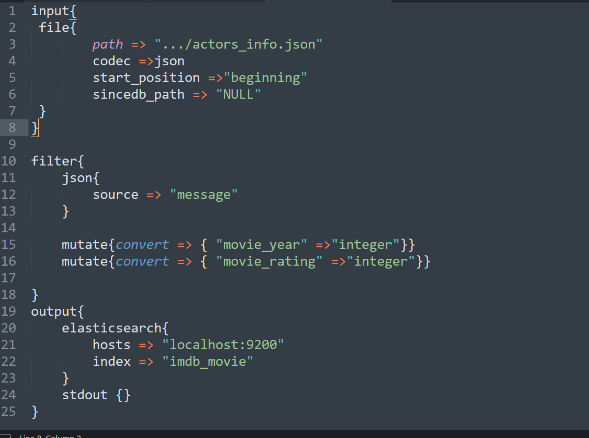

# Lab  7:  Using Elastic Stack to study scraped data 

## Task 7.3: Study the obtained data using the Elastic Stack

Basically, for this section we use local instalation of Elastic Stack due to the cloud version was not configured properly.

After we scraped the data we analyze it using the **elastic stack software** which is a collection of three major components  which are **Elasticsearch, Logstash, and Kibana** 
1. **Logstash**-  tool for managing events and logs
2. **Elasticsearch**-a document-oriented NoSQL database designed to store, retrieve and manage structured and semi-structured data.
3. **Kibana**- is data visualization and exploration tool 

Therefore in our configuration we use Logstash to index the json data into Elasticsearch and Kibana to visualize the data to drive useful insights.  
## Logstach configuration file to send data into an Elasticssearch  Index.

The configuration pipeline contain three sections.
1. **Input** -to specify the input file type, and encoding
2. **Filter**- to do filtering operation on the input file.  For example, we converted year from string to Integer 
3. **Output**- to specify the Elasticsearch index (imdb_movie)

**Note**-When the data is imported to Elasticsearch from any source, Logstash understands every field as a string; hence appropriate changes are required in the configuration file depending on the intended analysis. Data conversion is managed by Logstash **filter plugin**. As we can see in the configuration filter section, the **movie_year** and **movie_rating**   fields are defined to be treated as numbers rather than strings while indexing. This enables the user to perform numeric aggregations like average movie rating and other at various granularity levels.

Then using the configuration file we can start indexing the data by performing the following command line operation

When the data is properly indexed we can start analyzing it using kibana

## Visualization using Kibana 
## DashBoard without Filter

## Dashboard with Filter

We applied filter to all  visualization of the dashboard using actor name and the resulted dashboard is given below.<br 

## Top 3 actors each year.

This helps us to know the top three actors on each year based on the number of movies they participated.

## Tag cLoud of most popular actors by average movie rating

## Challenges
**Problem**:Unable to send live data from Pycharm to Elastic cloud. Though we configured the enviromental variables correctly we continously get the following error.

**Solution**:  We forced to use local installation of Elastic stack

